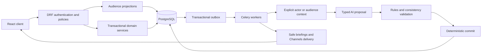

# Architecture and implementation boundaries

## What exists now

`backend/config` configures Django/DRF, PostgreSQL, Celery, and the Redis channel layer. `backend/apps/accounts` contains the UUID account model and initial migration. `/api/v1/health/` is process liveness only. There are no domain APIs, worker jobs, or WebSocket consumers yet.

`frontend/src` is a React/TypeScript landing shell that checks API liveness. It contains public premise text only. `docker-compose.yml` runs PostgreSQL, Redis, one-shot migrations, API, worker, and frontend locally. The development web server proxies `/api` to the backend. Production serving, static admin assets, readiness, proxy headers, and deployment hardening belong to P001/P036 as specified in their tasks.

## Intended data flow

This diagram describes planned behavior. No arrow implies that feature is already implemented.

## Domain modules to create as tasks require them

| Module | Ownership | First task |
| --- | --- | --- |
| accounts | Authentication, global settings, account lifecycle | P004 (UUID model already exists) |
| worlds / characters | Membership, clock, locations, role templates, capabilities | P002 |
| audit / events | Immutable audit, actions, causes, outbox, snapshots | P003/P009 |
| organizations | Membership, authority, internal knowledge | P005 |
| knowledge | Canonical facts, claims, knowledge edges, evidence, transmissions | P006 |
| social | Posts, revisions, comments, reactions, follows, feed | P015/P016 |
| messaging | Conversations, participant access, confidentiality, receipts | P017 |
| simulation | AI jobs, audience contexts, candidate validation, rendering, budgets | P019–P023 |
| notifications | Audience-safe delivery and preferences | P028 |
| moderation | Reports, sanctions, access audits, review queues | P029 |

Use simple `models.py`, `services.py`, `selectors.py`, `policies.py`, and `api.py` modules until their size warrants packages. Avoid precreating empty layers. Future planned file paths in TASKS.md are implementation targets, not existing files.

## Core contracts

Every domain object is scoped to a world and has an opaque UUID. Every reference supplied by a client is resolved against that world and the authenticated character. An actor ID is never trusted merely because it appears in a request body. Capability checks include current role, organization membership, world rules, and status.

Canonical facts never have a general-purpose client serializer. `project_claim_for_character(claim, character)` returns an allowlisted view or denies access; it must not return `fact_id`, `is_true`, hidden sources, or upstream IDs that identify a confidential source. The same selectors serve API and audience-facing AI. Membership revocation invalidates relevant caches and live subscriptions.

`submit_action(actor, world, action_type, payload, idempotency_key)` validates before accepting. Scope idempotency to world + actor + command, store a payload hash, return the previous result for an identical retry, and reject a changed payload with the same key. All world changes and their event/outbox records commit atomically.

The outbox provides at-least-once delivery. Downstream handlers store their deduplication records atomically with side effects; do not promise exactly-once broker delivery. Recheck state versions, capabilities, and world pause status at commit after any model call. Do not hold row locks open while waiting on an external model.

WorldEvents store canonical payload separately from visible projections. Public event titles, causal edges, source IDs, counts, and existence can themselves leak secrets. Filter them with the same rigor as descriptions. A public claim can remain false; confidence and verification do not reveal canonical truth.

Future APIs use `/api/v1/`, trailing slashes consistently, UUID resource IDs, and explicit world scoping. The UI may route by world slug, resolving that slug to a UUID. Cursor pagination uses a stable timestamp + UUID tiebreaker. Business errors should use `{code, detail, fields?}`; define the contract at P012 and apply it to earlier domain APIs then.

Never broadcast private payloads to a world-wide group. WebSockets are delivery hints; REST provides permission-checked catch-up. Public rendering uses only public source projections; privileged planner context never enters a newsroom prompt. A forbidden-word check alone is insufficient to prove semantic secrecy.

## Delivery gates

Prototype requires P002–P011 (including dependencies). Closed alpha additionally requires all alpha tasks through P037. Optional Should and Later work is explicitly separate in TASKS.md. A successful frontend build is not a product acceptance test; a fake provider is not proof of live model quality; startup is not a load test.
